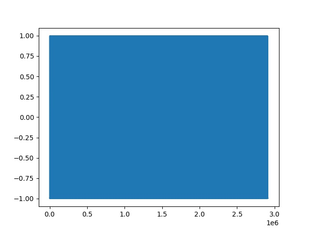
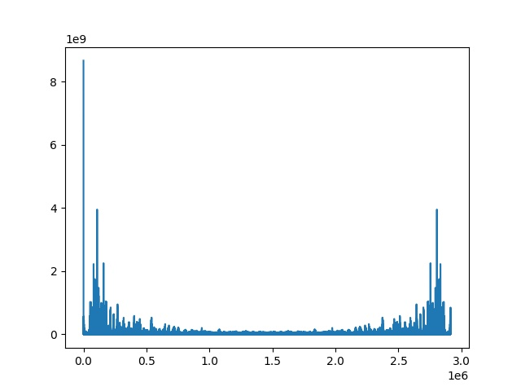

# Music-notes-detection
This project has 3 parts to it:
1. Note-detection which can detect a note in a song
2. Scale detection which can detect the scale a song is based on
3. Generating music notes from the frequencies, further leading to making songs

## Note detection:

Here I have used the fast Fourier transformation method to convert time frames to frequency frames. 
The musical note frequency is found at the first peak of frequency-amplitude plot (the graph resultant from the Fast Fourier Transform).

The Fourier transform is a sophisticated signal analysis technique that is utilised in a variety of applications, including audio processing and picture compression. In its scipy.fft module, SciPy offers a comprehensive implementation.

Note: this program can only be used for detecting a single note that is most dominant from a given wav file. The corresponding frequency of the note will have the largest peak in the Fast Fourier Transform, after which it can be mapped to the exact note. 

The plots are explained below for the violin solo of the song Canon in D taken from here

This image is for the density of the notes in the song (raw data)



This image is after performing the Fast Fourier Transform on the normalisation applied to the raw song



## Scale Detection:

For idenitfying the scale of the song, I have used the music21 toolkit, available for python. This module has several functions to detect the principal key signature of a song and identifies the scale using the Krumhansl-Schmuckler algorithm. I have expanded on how the algorithm is used in the writeup on the page linked here.

The Krumhansl-Schmuckler algorithm was developed, and it was built on the concept that the pitch class distribution of the notes in a piece of music could reveal its tonality essentially by computing the similarity of the distribution with each of the 12 major and minor profiles, and predicting the most associated key.

## Generating Music

Now we can generate and recreate music. After getting all the notes from a particular song (for this use music_notes_detection.py at an extremely slow framerate such that it can identify each and every single note), we can put them all together while specifying a particular note length for each note.

There are a few parameters we keep in mind like the bar length (specified by the time-signature of a song - most commonly it is 4/4, for waltz it is 3/4 and so on - it can be thought as the number of crotchets in particular time frame), the ADSR levels (Attack, Decay, Sustain and Release) that are used to control the loudness of the song and the sustain levels, which are concerned with how long a note needs to be sustained with for how long.

In this piece of code I have recreated the first part of the violin duet of Canon in D. Any song can be recreated in this way, as long as the length of the bar specified is not violated and the notes are known.

### The command to Run Code: 

For note and key detection,
```
$ python3 music_notes_detection.py
```

For generating the scale (the first part of generation):
```
$ python3 music_notes_generator.py
```

For generating the song (the second part of generation):
```
$ python3 song.py
```


